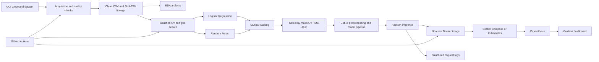
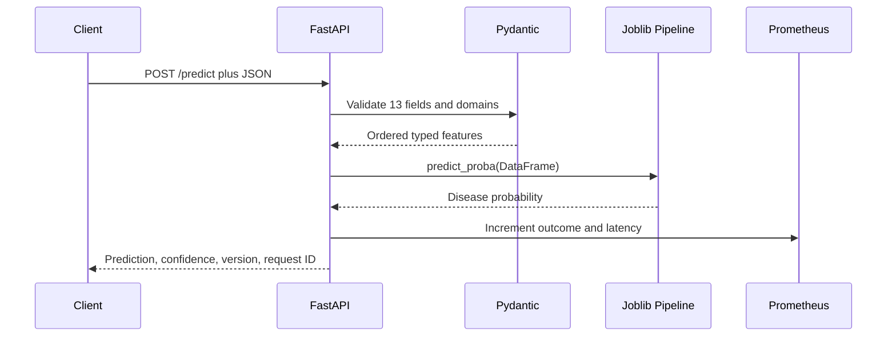

# Architecture and Design Decisions

## System Context

## Training Flow

1. The downloader retries requests, writes atomically, and caches the UCI source.
2. Cleaning maps missing tokens, checks valid domains, removes duplicates, and binarizes the target.
3. A stratified split reserves 20% as an untouched test set.
4. Imputation, scaling, and encoding are fitted inside each cross-validation fold.
5. Logistic Regression and Random Forest hyperparameters are searched under the same folds.
6. Mean CV ROC-AUC selects the model; the test set estimates final generalization.
7. MLflow stores parameters, metrics, variation, plots, signatures, and candidate models.
8. The selected full pipeline and metadata are written atomically for serving.

## Serving Flow

## Production Controls

| Concern | Control |
|---|---|
| Training/serving skew | Preprocessing and classifier serialized in one pipeline |
| Leakage | Imputation and encoding fitted within CV pipeline |
| Reproducibility | Pinned dependencies, fixed seed, source checksum, run metadata |
| Invalid input | Strict Pydantic schema, forbidden extra fields, bounded domains |
| Availability | Model-aware health endpoint and Kubernetes probes |
| Scalability | Stateless API, one worker per container, two Kubernetes replicas |
| Resource safety | Kubernetes CPU/memory requests and limits |
| Container safety | Non-root user, read-only root, no privilege escalation, dropped capabilities |
| Observability | JSON logs, request IDs, Prometheus metrics, Grafana dashboard |
| Privacy | Clinical feature values are not written to request logs |
| CI quality | Lint and tests block training and packaging on failure |

